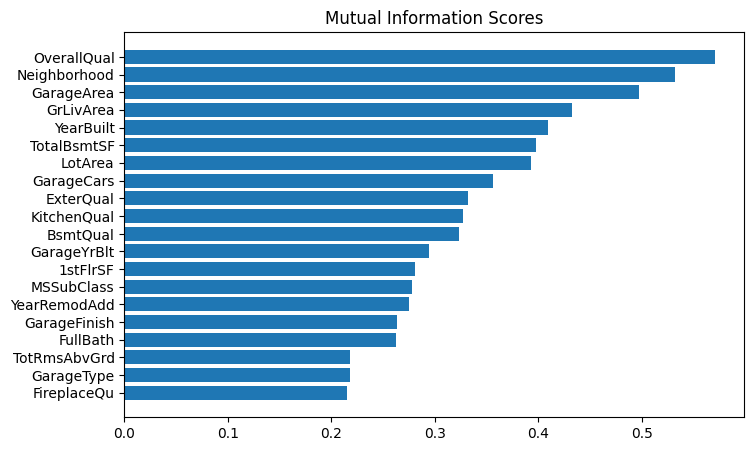
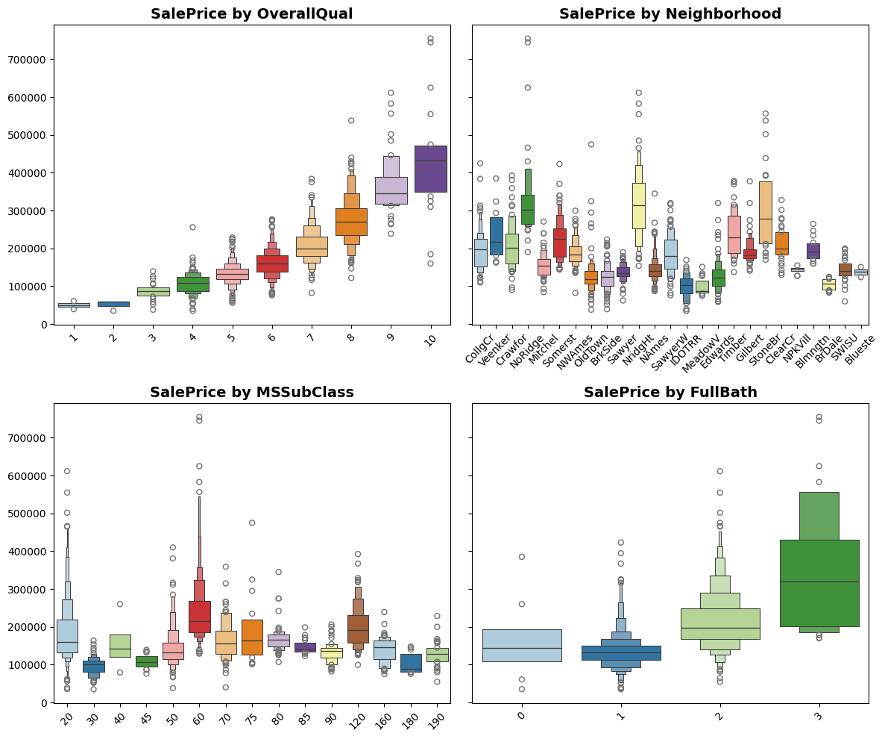
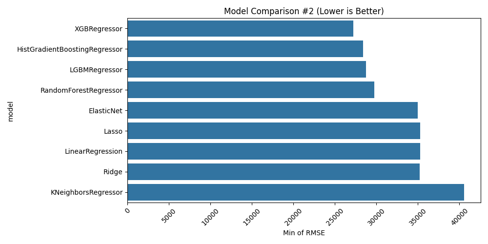
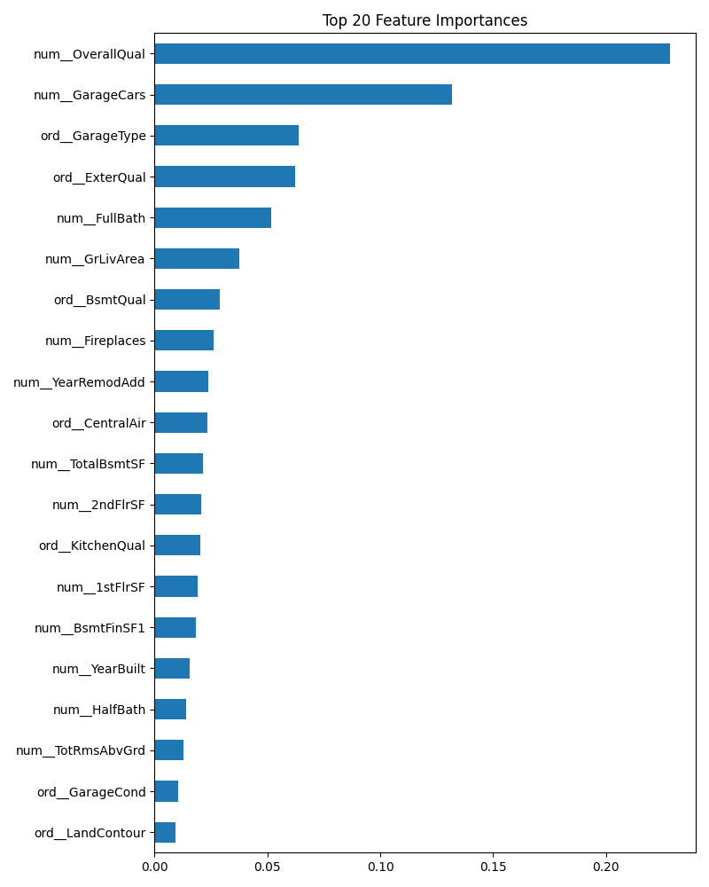
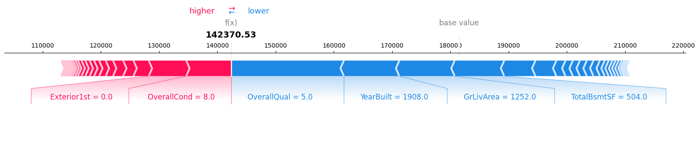
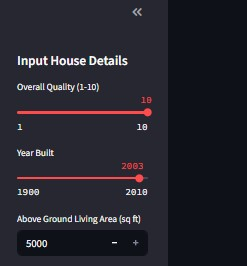
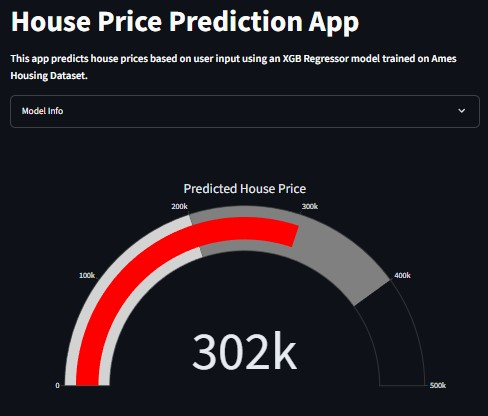
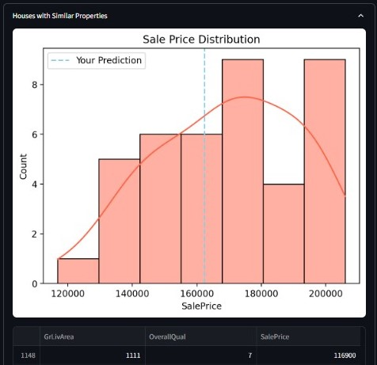

# (Not So Boring) House Price Prediction 
A web-based ML app that predicts house prices based on user-selected features. 
Built using Streamlit, scikit-learn, xgboost, and pandas. It's kinda fun tbh. 

## Project Overview
This project uses the **Ames Housing Dateset** from Kaggle Competition to build a machine learning model that predicts home prices based on various features like house's quality, number of rooms, and location.
The final result is deployed in a dashboard using **Streamlit**.

## ML Lifecycle
- Explore data and visualize key patterns
- Clean and preprocess the dataset
- Train multiple models (linear, tree, and K-Nearest) and evaluate performance
- Tune and select the best model
- Create an interactive Web App using Streamlit for prediction

## Dataset
- Source: [Kaggle Competition](https://www.kaggle.com/c/house-prices-advanced-regression-techniques)
- Dimension: (1460, 80)
- Target: `SalePrice`
- Features: 79; including numeric, ordinal, and nominal

## Tech Stack
- Language: Python
- Libraries: pandas, numpy, seaborn, matplotlib, scikit-learn, xgboost, lightgbm, (optional: shap)
- Dashboard: Streamlit
- Version Control: Git, GitHub
- Deployment: Streamlit Cloud

## Key Results
### Exploratory Data Analysis (EDA)
Take a look at `notebooks/01_eda.ipynb` for a full discussion. 
- Some features have lots of missing values which will be dropped when modeling
- Target (`SalePrice`) is right-skewed, log-transform might improve model stability, but who knows? 
- Only a few numerical features are highly correlated with the target, and some are highly correlated with each other

   
*Mutual information shows feature's association with the target, we will probably use the top 20 as our predictors.*

  
*Aren't those boxenplots interesting?*

### Model Comparison
Inspect `notebooks/02_modeling_basic.ipynb` and `notebooks/03_modeling_advanced.ipynb` for more information. 
- We choose model based on MSLE (square root of mean squared log error) but evaluate it using RMSE (square root of mean squared error) for the sake of interpretability. Weird, eh? 
- For a very basic modeling without tuning (using 80% split, evaluated with 5-fold cv), the best model is HGBRegressor. Using 20% test split, we got 0.144 MSLE and ~28k RMSE, so the mean prediction error is around 28k (note that minimum saleprice is ~35k, median saleprice is ~163k) which isn't really good prediction in average (~17% error, based on a median price), let alone for a cheaper house. (Another note: I should've just used the cv result to compare between model, and the test set only to do the final model explanation. Dude, it's a waste of secret-ness).
- Feature engineering, that I worked so hard on, is somehow a flop (what a waste of time)
- Anyway, the best 4 are tree models, followed by 4 linear models, and the last one is KN regression
- For the first tuning, you can take a look at this barplot. Uhm, not that different with the best from untuned model.     
      
    *It shows the best model for each algorithm based on RMSE value*
- For the second tuning, we focus training on tree models. Unfortunately, there's no significant increase compared to the first tuning. Those hours of tuning.... 
- For the last model, we only use 19 best features (and low-correlated one). The results is of course, lower than the previous one, but pretty much on par with the base model.
- What model do I choose? I guess I should go with the second tuning (well, let's make that waste of time a bit more useful.)

### Final Model
For the final model evaluation, I will do it on colab. Yeah, my lp's suck. You can load the final model in `models/final_model.joblib`
- Model: XGBRegressor
- MSLE: 0.138
- RMSE: 25,612 (~15.7% error, based on the median price)
      
- Top 5 Features: OverallQual, GarageCars, ExterQual, GrLivArea, and GarageType (based on tree's feature importance)

Well, I want to explore something more using SHAP things in colab tho. Ehhe. For now, it's done.
- Based on SHAP feature importance, we instead have OverallQual, GrLivArea, TotalBsmtSF, BsmtFinSF1, and GarageCars as our top 5 features, which affected price positively.
- We could also take a look at individual value, and inspect how each feature affect the final prediction, like this one below, where its predicted price is around 14k, lower than base value (mean house price: ~18k), which is influenced positively by: OverallCond 8 and Exteriro1st 0 (AsbShng); while negatively influenced by: OverallQual 5, YearBuilt 1908, GrLivArea 1252, and TotalBsmtSF 504


## Project Structure
- `notebooks/`: EDA & modeling notebooks, contains colab's nb that shouldn't be run
- `models/`: Several useless models, final trained model (`joblib`) and feature list (`json`)
- `data/`: Raw and cleaned data files
- `outputs/`: Generated charts and figures
- `app/`: Streamlit app
- `requirements.txt`: Python dependencies

## How to Run This Project
```bash
# Clone this repo
git clone https://github.com/irdazh/house-price-prediction.git

# Create a virtual env and install requirements
python -m venv .venv
source .venv/bin/activate #or .venv\Scripts\activate on Windows
pip install -r requirements.txt 

# Run notebooks in order
jupyter notebook

# Run the streamlit app
streamlit run app/app.py
```

## Web App
Follow this link: https://irdazh-house-price-prediction.streamlit.app/   
  
*Input Page*
  
*Prediction Result*
  
*Plot for Visualization*

## About Me
This is a part of my data science portfolio -- 
built during my free time as a jobless loafer. More projects and anything else, go:
[GitHub](https://github.com/irdazh) |
[Kaggle](https://www.kaggle.com/irdazh) |
[LinkedIn](https:///www.linkedin.com/in/daud-ma)

### Another Tutorial (Author's note: ignore it)
```bash
# as a starter
mkdir house-price-prediction
cd house-price-prediction

# init the git, then
mkdir app data models notebooks outputs scripts

# create venv
python -m venv .venv
source .venv/Scripts/activate #or .venv/bin/activate
pip install [list of packages]
```